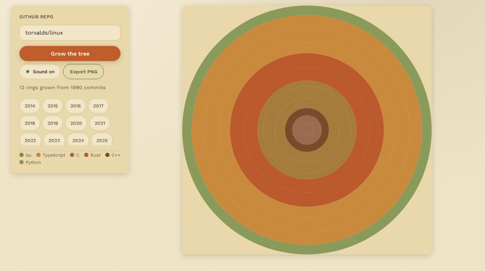

# Ringwood

**▶ Live demo: [apps.charliekrug.com/ringwood](https://apps.charliekrug.com/ringwood/)**

[](https://github.com/ctkrug/ringwood/actions/workflows/ci.yml)
[](LICENSE)

See any GitHub repo's history as growth rings. Paste a public repository, watch one ring grow
for every year it was active, and export the finished trunk as a PNG.



*[`davidbau/seedrandom`](https://github.com/davidbau/seedrandom): 161 commits across seven
years, JavaScript-dominant with JSON, HTML, and Markdown bands.*

## Why rings

Every tool that visualizes a repository produces the same picture: a contribution heatmap, a
commit-frequency chart, a grid of green squares. They are accurate and nobody ever posts them.

Growth rings are a format people already read without a legend. Wide ring, good year. Thin
ring, quiet year. A project that went dormant for two years and came back keeps those lean
years as visible scars instead of dropping them off the chart. Dendrochronology solved this
visual problem centuries ago, and commit history happens to fit the same shape.

## What it does

- **One ring per calendar year.** Ring width scales with that year's commit count against the
  repo's own busiest year, so a tree reflects the project's shape rather than absolute volume.
- **Color bands by language.** Each ring is banded by the languages its commits actually
  touched, sampled from the files in those commits, with a ranked legend beside the tree.
- **Grows in front of you.** Rings ease outward one year at a time, with a synthesized tick per
  ring and a brighter chime on the last. Mute persists across reloads.
- **Inspect any year.** Hover or tap a ring for its commit count and dominant language. A
  tabbable list of year chips gives keyboard users the same stats.
- **Export a PNG.** One button, named after the repo, for example
  `torvalds-linux-ringwood.png`. The button turns on once the tree finishes growing.
- **Honest failure states.** A missing repo says so. A rate limit says how many minutes are
  left. A repo with no commits gets a designed empty state instead of a blank canvas.

## Usage

Open the [live demo](https://apps.charliekrug.com/ringwood/) and paste one of:

```
sveltejs/svelte
https://github.com/rust-lang/mdBook
https://github.com/tailwindlabs/tailwindcss/tree/main/packages
```

Shorthand, full URLs, branch and file URLs, `.git` suffixes, and pasted query strings all
resolve to the same repository. Press Grow, then Export PNG once the last ring lands.

Your own oldest side project is usually the one worth trying first. The shape of it is rarely
what you remember.

## Limits

Ringwood talks to the public GitHub REST API from the browser with no token, which means:

- **Public repositories only.** There is no auth step, so there is no way to reach a private repo.
- **60 requests per hour per IP.** GitHub's anonymous ceiling, and the real constraint on what
  Ringwood can draw. History is fetched 100 commits per request (newest first), so one hour of
  quota covers roughly 6,000 commits. A repository past that size still renders: the tree grows
  from whichever recent commits the quota covered, and the status line says the limit was hit
  so it's reading a partial, most-recent slice rather than the full history. `torvalds/linux`,
  at over 1.4 million commits, would need about 14,600 requests, so its tree would only ever
  show its most recent handful of months.

## Stack

TypeScript and Canvas, built with [Vite](https://vitejs.dev/). Fully static and client-only:
no backend, no build-time secrets, no database, nothing stored about what you paste.

Ring thickness uses `sqrt(count / max)` rather than a linear scale. A ring's visible area grows
faster than its thickness the further out it sits, so linear scaling makes recent years look
much larger than they were.

## Development

```bash
npm install
npm run dev        # local dev server
npm run build      # production build to site/
npm test           # unit tests
npm run typecheck  # tsc, no emit
```

See [`docs/VISION.md`](docs/VISION.md) for the design rationale,
[`docs/DESIGN.md`](docs/DESIGN.md) for the visual direction, and
[`docs/ARCHITECTURE.md`](docs/ARCHITECTURE.md) for how the modules fit together.

## License

MIT. See [LICENSE](LICENSE).

---

More of Charlie's projects → [apps.charliekrug.com](https://apps.charliekrug.com)
